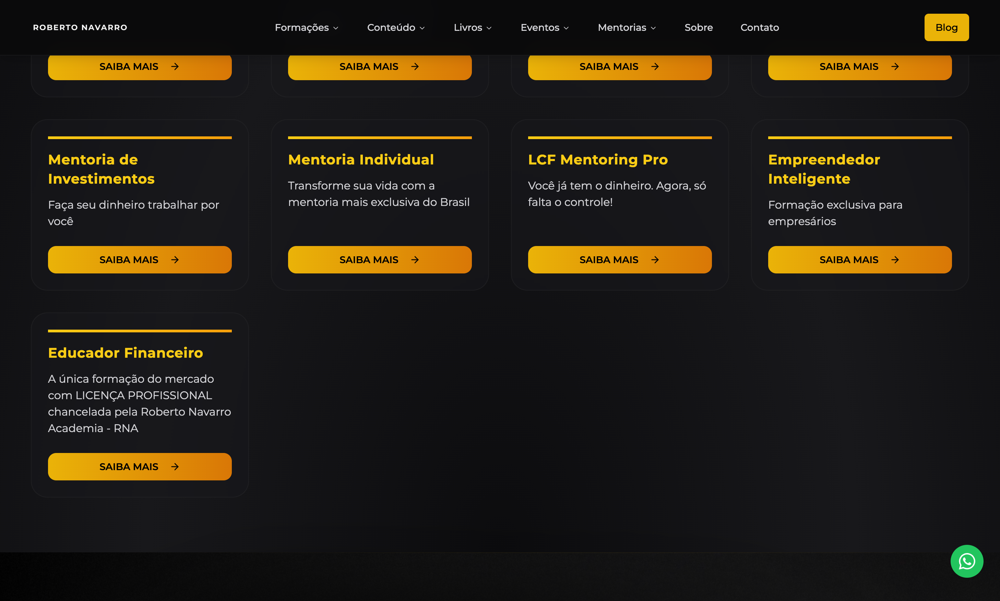
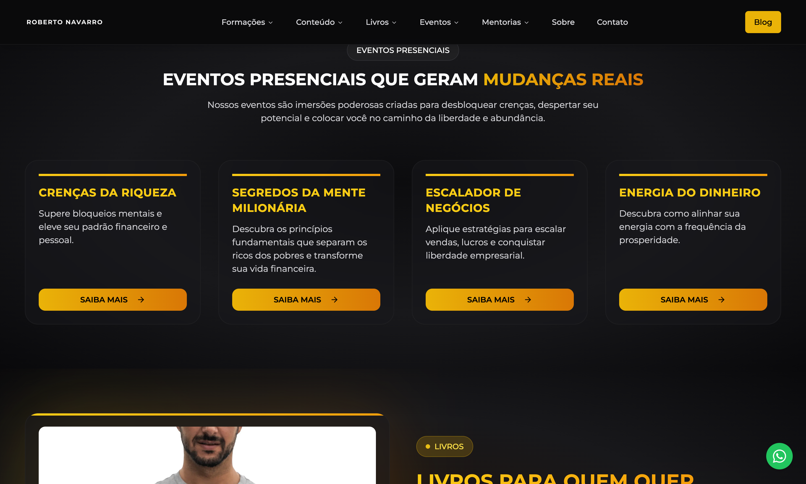

  

  Plataforma institucional e e-commerce do <b>Instituto de Coaching Financeiro (ICF)</b>.
   
  Mais de <b>300.000 vidas transformadas</b> — livros, cursos e mentorias com checkout integrado.

  <a href="https://robertonavarrooficial.com.br"><b>robertonavarrooficial.com.br</b></a>

  
  
  
  

---

  

---

## Por que existe

Roberto Navarro é referência em coaching financeiro no Brasil. O ICF (Instituto de Coaching Financeiro) precisava de uma plataforma que fosse **vitrine institucional + e-commerce** ao mesmo tempo: apresentar o método, vender livros e cursos, e converter visitantes em alunos — tudo com autonomia total da equipe de marketing via CMS.

---

## Screenshots (telas reais)

### Home — hero com proposta de valor + CTAs de conversão

### Cursos e programas — seção de ofertas com cards de mentoria

### Prova social — depoimentos e números de impacto (300k+ vidas)

### Livros — vitrine de publicações com link de compra

### Home completa (scroll)

---

## O que eu construí

| Feature | Detalhe |
|---------|---------|
| **Página institucional** | Apresentação do ICF, método exclusivo, resultados e depoimentos |
| **E-commerce integrado** | Livros, cursos online e programas de mentoria com checkout direto no site |
| **Checkout seguro** | Fluxo completo de compra sem sair da plataforma |
| **Payload CMS** | Headless, self-hosted — equipe de marketing edita tudo sem dev |
| **SEO otimizado** | Meta tags dinâmicas, Open Graph, sitemap |
| **Responsivo** | Otimizado para conversão em mobile (onde chega a maior parte do tráfego) |

---

## Stack

| Camada | Tecnologia |
|--------|------------|
| Frontend | Next.js 14 (App Router), React, Tailwind CSS |
| CMS | Payload CMS (headless, self-hosted) |
| E-commerce | Checkout integrado com gestão de produtos |
| Analytics | Google Analytics, Google Maps |
| Deploy | Vercel |

---

## Crédito

**João Vitor Moitinho Silva** — arquitetura, desenvolvimento full-stack, e-commerce e deploy.

---

## Licença

**Todos os direitos reservados.**
Este repositório é software proprietário. Uso, cópia, modificação ou redistribuição só com autorização expressa.

Veja: [LICENSE](LICENSE)
